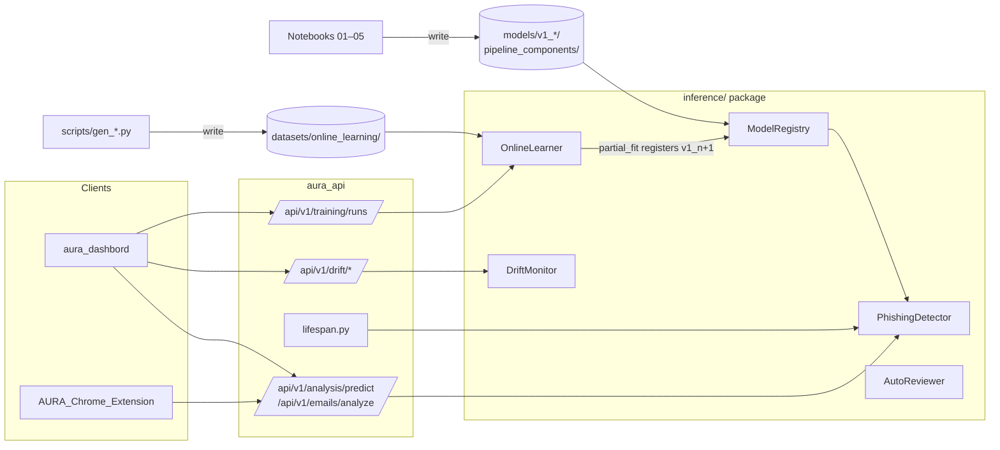

# AURA — Adaptive User Risk Analyzer

Phishing-email detection with three-zone confidence classification, calibrated
probabilities, online learning, drift monitoring, and optional LLM-backed
auto-review of uncertain predictions.

The training pipeline lives in five numbered notebooks at the repository root.
The integration surface for downstream applications is the `inference/` Python
package. Parity between the two is enforced by a golden fixture at
`inference/tests/fixtures/training_parity.json`.

---

## Contents

1. [What AURA does](#1-what-aura-does)
2. [Repository layout](#2-repository-layout)
3. [Training data](#3-training-data)
   - [The corpus is not in this repository](#the-corpus-is-not-in-this-repository)
4. [Training pipeline](#4-training-pipeline)
5. [Model selection and calibration](#5-model-selection-and-calibration)
6. [Setup and installation](#6-setup-and-installation)
   - [Getting the trained artefacts](#getting-the-trained-artefacts)
7. [The `scripts/` folder](#7-the-scripts-folder)
8. [The `inference/` package](#8-the-inference-package)
   - [Architecture](#81-architecture)
   - [PhishingDetector](#82-phishingdetector)
   - [OnlineLearner](#83-onlinelearner)
   - [ModelRegistry](#84-modelregistry)
   - [DriftMonitor](#85-driftmonitor)
   - [AutoReviewer](#86-autoreviewer)
   - [Data contracts](#87-data-contracts)
   - [Environment variables](#88-environment-variables)
9. [Integration examples](#9-integration-examples)
   - [Notebook / script](#91-notebook--script)
   - [FastAPI](#92-fastapi)
   - [Flask](#93-flask)
   - [CLI](#94-cli)
   - [Streamlit dashboard](#95-streamlit-dashboard)
10. [Tests](#10-tests)
11. [Limitations and known issues](#11-limitations-and-known-issues)

---

## 1. What AURA does

AURA classifies individual emails as phishing (label `1`) or legitimate
(label `0`). A prediction returns:

- a hard label (`0` or `1`) set by a configurable probability threshold
- a calibrated phishing probability (and the raw un-calibrated one for
  comparison)
- a three-zone confidence bucket (`NOT_SPAM` / `REVIEW` / `SPAM`) when zone
  thresholds are configured
- a UUID `prediction_id` that links the prediction to a later human
  confirmation, enabling drift tracking
- the 15 engineered feature values used by the model, for explainability

The `REVIEW` zone is the integration point for `AutoReviewer`, which calls an
LLM (Groq or Google AI Studio) to produce a structured verdict on predictions
the model is uncertain about.

`OnlineLearner` allows the production model to be adapted with new labelled
examples via scikit-learn's `partial_fit` without retraining from scratch.
`DriftMonitor` tracks confirmed vs. predicted labels in an append-only JSONL
log and signals when the false-positive rate crosses a configured threshold.

---

## 2. Repository layout

```
AURA_Model/
├── 01.combine_dataset.ipynb               # Load and merge 8 raw CSVs
├── 02.data_exploration_cleaning.ipynb     # EDA + text cleaning
├── 03.feature_engenering_data_preprocessing.ipynb  # TF-IDF + feature engineering
├── 04.model_training.ipynb                # Model competition + export
├── 05.model_calibration.ipynb             # Post-hoc probability calibration
│
├── datasets/
│   ├── raw/                 CEAS_08, Nazario (×3), Nigerian (×2), SpamAssasin, TREC_07
│   ├── processed/           combined_dataset.csv, cleaned_email_dataset.csv
│   ├── training/            final_dataset.csv (7015-column feature matrix)
│   ├── calibration/         X_val.npy, y_val.npy (held out from MLP training)
│   └── online_learning/     8 generated CSVs for model augmentation
│
├── models/
│   ├── pipeline_components/ subject_vectorizer.pkl, body_vectorizer.pkl, calibrator.pkl
│   └── v1_0/production/     phishing_detector_mlp_classifier.pkl, model_metadata.json
│
├── results/
│   ├── core_metrics.csv     Per-model accuracy / precision / recall / F1
│   ├── classwise_metrics.csv
│   ├── robustness_metrics.csv
│   ├── bias_metrics.csv
│   └── final_rankings.csv
│
├── inference/               Python package — the primary integration surface
│   ├── __init__.py          Re-exports every public symbol
│   ├── detector.py          PhishingDetector
│   ├── online_learner.py    OnlineLearner
│   ├── drift_monitor.py     DriftMonitor + DriftSignal + DriftStatus
│   ├── auto_reviewer.py     AutoReviewer
│   ├── registry.py          ModelRegistry
│   ├── preprocessing.py     Feature assembly pipeline
│   ├── schema.py            Data contracts and enums
│   ├── validation.py        Input validators
│   ├── examples/
│   │   ├── cli.py                   Single + batch CLI
│   │   ├── fastapi_app.py           REST service
│   │   ├── flask_app.py             REST service
│   │   ├── demo_*.ipynb             Jupyter walkthroughs
│   │   └── streamlit_dashboard/     Multi-page enterprise demo console
│   │       ├── app.py               Landing page (hero + KPIs)
│   │       ├── theme.py             Shared dark theme + components
│   │       ├── utils.py             Cached loaders + upload helpers
│   │       └── pages/               Predict, Batch, Auto Reviewer, Drift,
│   │                                Online Learning, Benchmarks, Registry
│   └── tests/               Parity, unit, and integration tests
│
├── .streamlit/
│   └── config.toml          Dark-theme tokens for the Streamlit dashboard
├── dashboard_data/          (gitignored) drift log produced by the dashboard
│
├── scripts/                 Data-generation scripts for online-learning augmentation
└── requirements.txt         Runtime dependencies of the inference package
```

---

## 3. Training data

The base model was trained on the publicly available email dataset at
**https://zenodo.org/records/8339691**.

The dataset bundles eight CSV files that are loaded individually in notebook
`01.combine_dataset.ipynb`:

| File | Rows | Label distribution |
|------|------|--------------------|
| CEAS_08.csv | 39,154 | 21,842 phishing / 17,312 legitimate |
| Nazario.csv | 1,565 | 1,565 phishing |
| Nazario_2.csv | 1,565 | 1,565 phishing |
| Nazario_5.csv | 3,065 | 1,565 phishing / 1,500 legitimate |
| Nigerian_5.csv | 6,331 | 3,332 phishing / 2,999 legitimate |
| Nigerian_Fraud.csv | 3,332 | 3,332 phishing |
| SpamAssasin.csv | 5,809 | 1,718 phishing / 4,091 legitimate |
| TREC_07.csv | 53,757 | 29,399 phishing / 24,358 legitimate |
| **Total** | **114,578** | |

All files share a common schema: `sender`, `receiver`, `date`, `subject`,
`body`, `label`, `urls`. The `receiver`, `date`, and `urls` columns are not
used during training.

All corpora are from the 2007–2008 era. This temporal gap is the reason the
`scripts/` folder exists — see [§7](#7-the-scripts-folder).

### The corpus is not in this repository

`datasets/` is gitignored, so a fresh clone has **no training data** and the
notebooks in [§4](#4-training-pipeline) cannot be run as-is. Only the small
benchmark and demo sets under `investigation/_datasets/` are tracked.

To re-train, download the bundle from
[Zenodo 8339691](https://zenodo.org/records/8339691) yourself and place the
eight CSVs where `01.combine_dataset.ipynb` expects them:

```
datasets/raw/CEAS_08.csv
datasets/raw/Nazario.csv
datasets/raw/Nazario_2.csv
datasets/raw/Nazario_5.csv
datasets/raw/Nigerian_5.csv
datasets/raw/Nigerian_Fraud.csv
datasets/raw/SpamAssasin.csv
datasets/raw/TREC_07.csv
```

Notebook `01` writes `datasets/processed/combined_dataset.csv`; the later
notebooks chain from there.

**You do not need any of this to run AURA.** Re-training is only for changing
the model itself — to run the platform, pull the pre-trained artefacts with
`scripts/fetch_artefacts.py` (see [§6](#6-setup-and-installation)).

---

## 4. Training pipeline

Run the five notebooks top-to-bottom in order. Each one reads artefacts
written by the previous.

### `01.combine_dataset.ipynb` — merge raw sources

Loads all eight CSVs from `datasets/raw/`, inspects schema and label
distribution per source, adds a `source_dataset` column, and concatenates into
`datasets/processed/combined_dataset.csv` (114,578 rows × 8 columns).

### `02.data_exploration_cleaning.ipynb` — EDA and text cleaning

- Profiles null rates, class balance, and character encoding artefacts across
  the combined set.
- Applies a five-step text cleaner (`clean_encoding`) to `sender`, `subject`,
  and `body`: HTML entity decode, U+FFFD strip, null-byte strip, whitespace
  collapse. This is the same function re-implemented verbatim in
  `inference/preprocessing.py`.
- Removes duplicate rows on `(sender, subject, body)` and rows where all three
  fields are empty.
- Writes `datasets/processed/cleaned_email_dataset.csv`.

### `03.feature_engenering_data_preprocessing.ipynb` — feature matrix

Applies two transformations to the cleaned text:

**TF-IDF vectorisation**

`normalize_for_tfidf` is applied before vectorisation: URLs are stripped (15
pattern set, see `inference/schema.py:URL_PATTERNS`), `!` and `?` are removed,
text is lowercased, and whitespace is collapsed. Note this step runs *after*
engineered features have already been computed on the un-normalised text.

- Subject TF-IDF: 2,000 features (`SUBJECT_TFIDF_DIM`)
- Body TF-IDF: 5,000 features (`BODY_TFIDF_DIM`)

Both vectorisers are fitted here and serialised to
`models/pipeline_components/subject_vectorizer.pkl` and `body_vectorizer.pkl`.

**Engineered features (15)**

Computed on the cleaned-but-unnormalised text in the order fixed by
`ENGINEERED_FEATURE_ORDER` in `inference/schema.py`:

| # | Feature | Description |
|---|---------|-------------|
| 0 | `body_word_count` | `len(body.split())` |
| 1 | `body_exclamation_count` | Count of `!` characters |
| 2 | `email_local_length` | Length of the local part before `@` |
| 3 | `name_email_consistency` | 1 if sender display name shares a 3-char substring with the local part (or local part is a shared-inbox role); 0 otherwise |
| 4 | `body_url_density` | `(url_count / word_count) × 100` |
| 5 | `body_url_count` | Matches against all 15 URL patterns |
| 6 | `body_entropy` | Shannon entropy of the body (excludes spaces) |
| 7 | `email_digit_ratio` | Digit proportion of the local part |
| 8 | `domain_entropy` | Entropy of the sender domain, dropping the TLD |
| 9 | `domain_length` | `len(sender_domain)` |
| 10 | `subject_entropy` | Shannon entropy of the subject (excludes spaces) |
| 11 | `body_avg_word_length` | `sum(len(w)) / len(words)` |
| 12 | `sender_name_exists` | 1 if display name is present in `Name <addr>` format |
| 13 | `subject_exclamation_count` | Count of `!` in subject |
| 14 | `domain_vowel_consonant_ratio` | Vowels / consonants in sender domain (y counts as consonant) |

**Feature matrix assembly**

Columns are concatenated in the fixed order `[subject_tfidf | body_tfidf | engineered]`,
producing a 7,015-column sparse matrix per row. No scaling is applied — the
MLP was trained on raw features.

The final matrix is saved to `datasets/training/final_dataset.csv`. A
validation/calibration partition of 14,868 rows is held out here as
`datasets/calibration/X_val.npy` and `y_val.npy`.

### `04.model_training.ipynb` — model competition and export

Four scikit-learn estimators are trained on the 69,379-row training split and
evaluated on the 14,868-row test split:

| Model | Composite score | Accuracy | F1 | ROC-AUC |
|-------|----------------|----------|----|---------|
| **MLP_Classifier** | **0.9924** | **0.9884** | **0.9898** | **0.9988** |
| PAC | 0.9636 | 0.9419 | 0.9511 | — |
| SGD_Hinge | 0.9131 | 0.9113 | 0.9171 | — |
| SGD_LogLoss | 0.7733 | 0.7778 | 0.7608 | — |

The winning `MLPClassifier` has three hidden layers `(256, 128, 64)`, ReLU
activations, Adam optimiser, adaptive learning rate starting at 0.001, L2
penalty `α=0.005`, batch size 256, and was trained for up to 200 epochs with
early stopping disabled (`early_stopping=False`) for deterministic export.

The trained model is serialised to
`models/v1_0/production/phishing_detector_mlp_classifier.pkl`. Full
hyperparameters and per-split sample counts are recorded in
`models/v1_0/production/model_metadata.json`.

### `05.model_calibration.ipynb` — post-hoc probability calibration

The MLP's raw probabilities are already well-calibrated (ECE 0.0103 before
calibration) but four calibrators are compared using the held-out
`X_val`/`y_val` partition:

| Calibrator | ECE | Brier |
|-----------|-----|-------|
| histogram_binning | 0.00208 | 0.01217 |
| platt_sigmoid | 0.00222 | 0.01250 |
| isotonic | 0.00437 | 0.01119 |
| **beta** | **0.00457** | **0.01123** |

Beta calibration is selected and serialised to
`models/pipeline_components/calibrator.pkl`. The inference module loads it
automatically when the file exists at that path.

---

## 5. Model selection and calibration

The production artefacts are:

| File | Description |
|------|-------------|
| `models/v1_0/production/phishing_detector_mlp_classifier.pkl` | Fitted `MLPClassifier` |
| `models/pipeline_components/subject_vectorizer.pkl` | Fitted `TfidfVectorizer` (2,000 features) |
| `models/pipeline_components/body_vectorizer.pkl` | Fitted `TfidfVectorizer` (5,000 features) |
| `models/pipeline_components/calibrator.pkl` | Beta calibrator (prob-in → prob-out) |

The registry version string is `v1_0`. `ModelRegistry.active_version()` reads
`models/model_metadata.json`; if no `active_version` is set there,
`load_production()` falls back to the latest version by numeric order.

---

## 6. Setup and installation

```bash
git clone <repo-url> aura
cd aura
python -m venv .venv
source .venv/bin/activate          # Windows: .venv\Scripts\activate
pip install -r requirements.txt
```

`requirements.txt` contains the runtime dependencies of the `inference/`
package only:

```
httpx>=0.27
betacal>=1.1
netcal>=1.4
```

The training notebooks additionally require pandas, numpy, scikit-learn,
joblib, scipy, matplotlib, and seaborn. Install those separately if you plan to
re-run the training pipeline:

```bash
pip install pandas numpy scikit-learn joblib scipy matplotlib seaborn
```

The inference package tests require pytest and portalocker:

```bash
pip install pytest portalocker
```

The Streamlit dashboard (see [§9.5](#95-streamlit-dashboard)) needs Streamlit
and Plotly:

```bash
pip install streamlit plotly
```

### Getting the trained artefacts

Trained artefacts are **not** tracked in git — `models/` and `*.pkl` are
gitignored, so a fresh clone has no detector and `aura_api` will boot with every
prediction endpoint returning 503. Pull the published set instead:

```bash
python scripts/fetch_artefacts.py                    # -> ./models
python scripts/fetch_artefacts.py --dest ../aura_api/models
python scripts/fetch_artefacts.py --force            # replace an existing set
```

The script is standard-library only — no `pip install` needed first. It downloads
[release `v1`](https://github.com/kudzaiprichard/aura-model/releases/tag/v1),
verifies the archive's SHA-256, and extracts this layout:

```
models/model_metadata.json                                  registry index, active = v1_0
models/pipeline_components/subject_vectorizer.pkl
models/pipeline_components/body_vectorizer.pkl
models/pipeline_components/calibrator.pkl
models/v1_0/production/phishing_detector_mlp_classifier.pkl
models/v1_0/production/model_metadata.json
models/v1_0/production/winner_summary.txt
```

Re-running is a no-op once the artefacts are in place. Point the backend at the
directory with `AURA_MODELS_DIR=/abs/path/to/models`.

Publishing a new set: zip the artefact root so `model_metadata.json`,
`pipeline_components/` and `v<major>_<minor>/` sit at the archive root (use
forward slashes — a Windows-built zip with backslash entries will not extract
correctly on macOS or Linux), attach it to a new release, then update
`RELEASE_TAG`, `ASSET` and `SHA256` at the top of `scripts/fetch_artefacts.py`.

**Model resolution.** `PhishingDetector.load_production()` and
`ModelRegistry` locate the `models/` directory using the following precedence:

1. `models_root` kwarg passed directly to the constructor or factory method
2. `AURA_MODELS_DIR` environment variable
3. `./models` relative to the working directory

---

## 7. The `scripts/` folder

The training corpus (Zenodo 8339691) consists entirely of emails from
2007–2008. The base model therefore has limited exposure to eight email
categories that have become prevalent since then:

| Category | Type | Target rows |
|----------|------|-------------|
| Brand impersonation | Phishing | 700 |
| Spear phishing | Phishing | 800 |
| Modern-technique phishing | Phishing | 1,500 |
| Commercial notifications | Legitimate | 1,500 |
| Newsletters / digests | Legitimate | 700 |
| Personal conversational | Legitimate | 1,000 |
| Professional internal | Legitimate | 800 |
| Retail transactional | Legitimate | 1,000 |

`scripts/` contains one generator and one verifier per category. Running the
generators produces labelled CSVs in `datasets/online_learning/` that can be
fed directly to `OnlineLearner.partial_fit_batch()` to adapt the production
model without retraining from scratch.

### Generator scripts

| Script | Label | Rows | Description |
|--------|-------|------|-------------|
| `gen_brand_impersonation.py` | 1 | 700 | Impersonates 8 modern SaaS brands (Teams, DocuSign, Zoom, Dropbox, WeTransfer, Notion, Slack, OpenAI) using typosquatted sender domains and fake URLs. Every row has ≥1 urgency/credential signal and 80–160 body words. |
| `gen_spear_phishing.py` | 1 | 800 | 5 impersonation types (colleague, IT, HR, executive, vendor); uses near-real domains, internal-process references, and authority pressure. |
| `gen_modern_technique_phishing.py` | 1 | 1,500 | 5 subtypes × 300 rows: QR-code phishing, cryptocurrency scams, AI-polished prose, callback phishing, multi-stage phishing. Structurally distinct per subtype (QR has no URL-in-body; callback forbids URLs entirely; multi-stage uses Re:/Fwd: prefixes). |
| `gen_commercial_notifications.py` | 0 | 1,500 | Genuine-looking transactional notifications from modern e-commerce and SaaS platforms. |
| `gen_newsletters_digests.py` | 0 | 700 | Newsletter and digest emails from realistic publisher senders. |
| `gen_personal_conversational.py` | 0 | 1,000 | Short personal emails with varied register and salutation styles. |
| `gen_professional_internal.py` | 0 | 800 | Internal-mail patterns: team updates, meeting requests, project status, IT announcements. |
| `gen_retail_transactional.py` | 0 | 1,000 | Order confirmations, shipping notices, invoices, and receipts from retail brands. |

Each generator seeds `random` with `20260418` for reproducibility, applies a
quality gate (word-count bounds, no URL shorteners, no real brand domains in
phishing rows, ≥1 explicit phishing signal per row, SHA-1 deduplication), and
raises `RuntimeError` if the target count cannot be reached within the allowed
attempt budget.

### Verifier scripts

Each `verify_*.py` script reads the corresponding generated CSV and asserts the
full quality spec: row counts, label correctness, no duplicate
`(sender, subject, body)` triples, no URL shorteners, word-count bounds, brand
or signal distribution constraints, and template-reuse caps. Run them after
generation to confirm the output is clean before feeding it to `OnlineLearner`.

```bash
python scripts/gen_brand_impersonation.py
python scripts/verify_brand_impersonation.py

python scripts/gen_spear_phishing.py
python scripts/verify_spear_phishing.py
# ... repeat for each category
```

The generated CSVs have five columns: `sender`, `subject`, `body`, `label`,
`category`. Load them with pandas and pass each row as a dict to
`OnlineLearner.partial_fit_batch`.

---

## 8. The `inference/` package

`inference/` is the primary integration surface. Every public symbol is
re-exported from `inference/__init__.py`:

```python
from inference import (
    PhishingDetector,
    OnlineLearner,
    ModelRegistry,
    DriftMonitor,
    DriftSignal,
    DriftStatus,
    AutoReviewer,
    AutoReviewSuccess,
    AutoReviewFailure,
    AutoReviewResponse,
    LLMProvider,
    ReviewLabel,
    PredictionResult,
    OnlineLearningResult,
    ConfidenceZone,
    ValidationError,
)
```

### 8.1 Architecture

```
inference/
├── detector.py        PhishingDetector — predict / predict_batch / predict_safe
├── online_learner.py  OnlineLearner — partial_fit_batch + promotion gating
├── drift_monitor.py   DriftMonitor — append-only JSONL FPR tracking
├── auto_reviewer.py   AutoReviewer — Groq / Google AI Studio over direct HTTP
├── registry.py        ModelRegistry — versioned artefact layout + integrity checks
├── preprocessing.py   Feature assembly: clean_encoding, normalize_for_tfidf,
│                      extract_engineered_features, build_feature_row,
│                      build_feature_matrix
├── schema.py          Data contracts: PredictionResult, OnlineLearningResult,
│                      DriftSignal, AutoReviewSuccess/Failure, enums, constants
├── validation.py      validate_email_inputs, validate_threshold,
│                      validate_review_thresholds, validate_training_batch
├── examples/
│   ├── cli.py              python -m inference.examples.cli
│   ├── fastapi_app.py      uvicorn inference.examples.fastapi_app:app
│   ├── flask_app.py        flask --app inference.examples.flask_app run
│   ├── demo_auto_reviewer.py
│   ├── demo_predict.ipynb
│   ├── demo_online_learning.ipynb
│   └── demo_drift_monitor.ipynb
└── tests/
    ├── test_parity.py                 Parity against training fixture
    ├── test_detector.py
    ├── test_preprocessing.py
    ├── test_registry.py
    ├── test_drift_monitor.py
    ├── test_auto_reviewer.py
    ├── test_calibrator_distinct_outputs.py
    └── fixtures/
        ├── training_parity.json       Golden reference: 20+ email records
        └── _generate_fixture.py       Re-generate the fixture from notebook output
```

### 8.2 PhishingDetector

The main entry point for prediction. Stateless and thread-safe when
instantiated once per thread.

#### Construction

**`PhishingDetector.load_production(models_root=None)`**

Loads the active version from the registry, or the latest version if no active
version is set. Automatically loads the calibrator from
`pipeline_components/calibrator.pkl` if it exists.

```python
detector = PhishingDetector.load_production()
detector = PhishingDetector.load_production(models_root='/srv/models')
```

**`PhishingDetector.load(version, models_root=None)`**

Loads a specific registered version.

```python
detector = PhishingDetector.load('v1_0')
```

**`PhishingDetector.from_paths(model_path, subject_vectorizer_path, body_vectorizer_path, *, calibrator_path=None, review_low_threshold=None, review_high_threshold=None, drift_monitor=None)`**

Loads artefacts from explicit paths. Use when you manage paths yourself or need
to override specific files.

```python
detector = PhishingDetector.from_paths(
    model_path='models/v1_0/production/phishing_detector_mlp_classifier.pkl',
    subject_vectorizer_path='models/pipeline_components/subject_vectorizer.pkl',
    body_vectorizer_path='models/pipeline_components/body_vectorizer.pkl',
    calibrator_path='models/pipeline_components/calibrator.pkl',
    review_low_threshold=0.3,
    review_high_threshold=0.8,
)
```

**Constructor kwargs**

| Kwarg | Type | Default | Description |
|-------|------|---------|-------------|
| `calibrator` | prob-in/prob-out object | `None` | Applied via `.transform([raw_prob])` or `.predict([raw_prob])`. Classifier-style calibrators (`predict_proba`) are rejected at inference time. |
| `review_low_threshold` | float in [0, 1] | `None` | Lower REVIEW-zone boundary. Must be set together with `review_high_threshold`. |
| `review_high_threshold` | float in [0, 1] | `None` | Upper REVIEW-zone boundary. Must satisfy `low < high`. |
| `drift_monitor` | `DriftMonitor` | `None` | When set, every `predict()` and `predict_batch()` call automatically records the prediction via `record_prediction`. |

Both review thresholds must be provided together or both omitted — partial
configuration raises `ValidationError`.

#### Zone classification

```
phishing_probability < review_low_threshold   → ConfidenceZone.NOT_SPAM
review_low_threshold ≤ probability < high     → ConfidenceZone.REVIEW
probability ≥ review_high_threshold           → ConfidenceZone.SPAM
```

Exact boundaries bucket upward, consistent with `int(prob >= threshold)` for
`predicted_label`. Zone classification requires both thresholds to be set;
otherwise `confidence_zone` is `None`.

#### Prediction methods

**`predict(sender, subject, body, *, threshold=0.75) → PredictionResult`**

Single-email prediction. Raises `ValidationError` if `sender`, `subject`, or
`body` is not a string, or if all three are empty, or if `threshold` is outside
[0, 1].

```python
result = detector.predict(
    sender='"PayPal Security" <service@paypa1-alerts.com>',
    subject='URGENT: verify your account',
    body='Click http://paypa1-alerts.com/verify to avoid suspension.',
    threshold=0.75,
)

print(result.predicted_label)          # 0 or 1
print(result.phishing_probability)     # calibrated probability
print(result.raw_phishing_probability) # uncalibrated probability
print(result.confidence_zone)          # ConfidenceZone enum or None
print(result.prediction_id)            # UUID4 string
print(result.engineered_features)      # dict with 15 keys
print(result.to_dict())               # JSON-serialisable dict
```

**`predict_safe(sender, subject, body, *, threshold=0.75) → dict`**

Never raises. Returns `result.to_dict()` on success, or an error envelope on
failure:

```python
payload = detector.predict_safe(sender, subject, body)
if 'error' in payload:
    # {'error': 'validation_error' | 'internal_error', 'message': '...'}
    log.warning(payload['message'])
else:
    process(payload)
```

**`predict_batch(emails, *, threshold=0.75) → list[PredictionResult]`**

Processes all emails in a single vectorised forward pass. Each email must be a
dict with `sender`, `subject`, and `body` string fields.

```python
results = detector.predict_batch(
    [
        {'sender': s1, 'subject': sb1, 'body': b1},
        {'sender': s2, 'subject': sb2, 'body': b2},
    ],
    threshold=0.5,
)
```

#### `PredictionResult` fields

```
predicted_label:            int            0 or 1
phishing_probability:       float          calibrated (or raw if no calibrator)
legitimate_probability:     float          1 - phishing_probability (when calibrated)
threshold:                  float          threshold used for this prediction
model_version:              str | None     version string from registry
engineered_features:        dict[str, float]   15 keys in ENGINEERED_FEATURE_ORDER
raw_phishing_probability:   float | None   pre-calibration value
raw_legitimate_probability: float | None   pre-calibration value
calibrated:                 bool
confidence_zone:            ConfidenceZone | None
review_low_threshold:       float | None
review_high_threshold:      float | None
prediction_id:              str | None     UUID4; None only when drift_monitor absent
```

`to_dict()` converts `confidence_zone` to its string value
(`'SPAM'`, `'NOT_SPAM'`, `'REVIEW'`).

### 8.3 OnlineLearner

Adapts the production model with new labelled examples using scikit-learn's
`partial_fit`. Cross-process writes are serialised via a `portalocker` exclusive
lock on `{models_root}/.lock`.

**Not thread-safe for shared instances.** Use one `OnlineLearner` per thread.

#### Construction

```python
from inference import OnlineLearner
import pandas as pd
import numpy as np

learner = OnlineLearner(
    models_root='./models',
    holdout_set=(holdout_df, y_holdout),  # optional
    oov_warn_threshold=0.30,               # default
)
```

| Kwarg | Type | Default | Description |
|-------|------|---------|-------------|
| `registry` | `ModelRegistry` | `None` | If `None`, constructed from `models_root`. |
| `models_root` | Path / str | `None` | Used when `registry` is `None`. Falls back to `AURA_MODELS_DIR` then `./models`. |
| `holdout_set` | `(DataFrame, ndarray)` | `None` | If provided, before/after metrics are computed on this set. Without it, `performance_before` and `performance_after` in the result are empty dicts. |
| `oov_warn_threshold` | float | `0.30` | Fraction of tokens outside the training vocabulary that triggers a `log.warning`. |

#### `partial_fit_batch(emails, *, source_version=None, max_iter_per_call=5) → OnlineLearningResult`

`emails` is a list of dicts, each with `sender`, `subject`, `body` (str) and
`label` (int, 0 or 1). Both classes must be present in the batch
(`min_per_class=1`).

`max_iter_per_call` caps the number of `partial_fit` iterations per call
(default 5). `early_stopping` is forced to `False` on the copy before fitting.

The method:
1. Acquires the portalocker write lock.
2. Loads the source version (active → latest → specified).
3. Measures before-metrics on the holdout set.
4. Computes OOV rates for subject and body.
5. Calls `partial_fit` up to `max_iter_per_call` times.
6. Measures after-metrics.
7. Registers the new version via `ModelRegistry.register_new_version`.
8. Returns an `OnlineLearningResult` with `promoted=False`.

The new version is **not promoted** automatically. Review the metrics and call
`promote()` explicitly.

```python
result = learner.partial_fit_batch(
    emails=[
        {'sender': s, 'subject': sb, 'body': b, 'label': y}
        for s, sb, b, y in training_data
    ],
    max_iter_per_call=5,
)
print(result.new_version)             # e.g. 'v1_1'
print(result.performance_before)      # {'accuracy': ..., 'f1': ..., ...}
print(result.performance_after)       # same keys
print(result.oov_rate_subject)        # fraction of subject tokens OOV
```

#### `promote(version, *, min_delta_f1=-0.01) → None`

Promotes a registered version to active. Refuses if the F1 delta
`(after - before)` is below `min_delta_f1`.

```python
learner.promote(result.new_version, min_delta_f1=-0.01)
```

#### `OnlineLearningResult` fields

```
new_version:          str     registered version string (e.g. 'v1_1')
source_version:       str     version that was fine-tuned
batch_size:           int
iterations:           int     actual partial_fit calls made
performance_before:   dict    accuracy/precision/recall/f1 on holdout (or {})
performance_after:    dict    same
oov_rate_subject:     float
oov_rate_body:        float
promoted:             bool    always False from partial_fit_batch
```

### 8.4 ModelRegistry

Manages the versioned artefact layout on disk:

```
<models_root>/
    pipeline_components/
        subject_vectorizer.pkl
        body_vectorizer.pkl
        calibrator.pkl               # optional
    v<major>_<minor>/production/
        phishing_detector_mlp_classifier.pkl
        model_metadata.json
    model_metadata.json              # registry-level: active_version + versions dict
```

#### Key methods

| Method | Returns | Description |
|--------|---------|-------------|
| `list_versions()` | `list[str]` | All valid versions with a model file, sorted by `(major, minor)` |
| `active_version()` | `str \| None` | Value of `active_version` in the registry metadata |
| `latest_version()` | `str \| None` | Last item from `list_versions()` |
| `paths_for(version)` | `dict[str, Path \| None]` | Resolved paths for `model`, `subject_vectorizer`, `body_vectorizer`, `calibrator` |
| `set_active(version, *, verify_integrity=True)` | `None` | Sets `active_version`; verifies SHA-256 by default |
| `promote(version, metrics)` | `None` | Sets `promoted=True` and writes metrics in the registry JSON |
| `register_new_version(model, source_version, metrics=None, *, calibrator_path=None)` | `str` | Serialises the model, computes SHA-256, bumps the minor version, writes registry JSON |

`register_new_version` increments the minor number within the same major:
source `v1_0` → new `v1_1`, source `v1_3` → new `v1_4`. All JSON writes are
atomic (temp file + `os.replace`).

```python
from inference import ModelRegistry

registry = ModelRegistry('./models')
print(registry.list_versions())    # ['v1_0']
print(registry.active_version())   # None or 'v1_0'
registry.set_active('v1_0')
```

### 8.5 DriftMonitor

Tracks prediction vs. confirmation pairs in an append-only JSONL log.
Reconstructs its in-memory confusion matrix from the log on construction, so it
survives process restarts. Cross-process writes are serialised via portalocker
on the log file itself.

**Not thread-safe for shared instances.** Use one per thread.

#### Construction

```python
from inference import DriftMonitor

monitor = DriftMonitor(
    log_path='logs/drift.jsonl',
    fpr_threshold=0.10,          # default
)
```

| Kwarg | Type | Default | Description |
|-------|------|---------|-------------|
| `log_path` | str / Path | required | Created if missing. Replayed on construction. |
| `fpr_threshold` | float in [0, 1] | `0.10` | FPR level at which `drift_signal().status` becomes `WARNING`. |

#### Methods

**`record_prediction(prediction_id, predicted_label, predicted_probability, model_version, timestamp=None)`**

Called automatically by `PhishingDetector` when a `DriftMonitor` is attached.
Can also be called manually.

**`record_confirmation(prediction_id, confirmed_label, timestamp=None)`**

Links a true label to a previously recorded prediction. Raises `ValueError` on
an unknown or duplicate `prediction_id`.

**`confusion_matrix() → dict`**

Returns `{'tp': int, 'tn': int, 'fp': int, 'fn': int}` from confirmed pairs
only.

**`false_positive_rate() → float`**

`fp / (fp + tn)`. Returns `0.0` when no negatives have been confirmed yet.

**`drift_signal() → DriftSignal`**

```python
signal = monitor.drift_signal()
print(signal.status)            # 'OK' or 'WARNING'
print(signal.false_positive_rate)
print(signal.total_predictions)
print(signal.confirmed_predictions)
print(signal.threshold)
print(signal.message)
print(signal.to_dict())
```

#### JSONL record formats

```json
{"type": "prediction",   "prediction_id": "<uuid4>", "predicted_label": 1,
 "predicted_probability": 0.91, "model_version": "v1_0",
 "timestamp": "2026-04-18T07:00:00+00:00"}

{"type": "confirmation", "prediction_id": "<uuid4>", "confirmed_label": 1,
 "timestamp": "2026-04-18T08:00:00+00:00"}
```

See `inference/examples/demo_drift_monitor.ipynb` for a full simulation
including restart-and-replay.

### 8.6 AutoReviewer

LLM-backed adjudicator for `REVIEW`-zone predictions. Calls Groq or Google AI
Studio over direct HTTP (no provider SDKs). Never raises — all failures are
captured as `AutoReviewFailure`.

#### Construction

```python
from inference import AutoReviewer, LLMProvider

reviewer = AutoReviewer(
    provider=LLMProvider.GROQ,
    api_key='gsk_...',
    model_name=None,           # default: 'llama-3.3-70b-versatile'
    timeout_seconds=30.0,
    max_retries=2,
)
```

| Kwarg | Type | Default | Description |
|-------|------|---------|-------------|
| `provider` | `LLMProvider` | required | `LLMProvider.GROQ` or `LLMProvider.GOOGLE` |
| `api_key` | non-empty str | required | Provider API key |
| `model_name` | str \| None | per-provider | Groq: `llama-3.3-70b-versatile`; Google: `gemini-3-flash-preview` |
| `timeout_seconds` | float > 0 | `30.0` | Per-request HTTP timeout |
| `max_retries` | int ≥ 0 | `2` | Retries on 5xx and transport errors only. 4xx fails fast. |
| `http_client` | `httpx.Client \| None` | `None` | Injectable for testing. Owned and closed internally when `None`. |

#### Methods

**`review(sender, subject, body, engineered_features=None) → AutoReviewResponse`**

Calls the LLM and returns either `AutoReviewSuccess` or `AutoReviewFailure`.
Never raises.

The LLM is prompted to reply with a JSON object:

```json
{
  "label": "PHISHING" | "LEGITIMATE" | "UNCERTAIN",
  "confidence": "high" | "medium" | "low",
  "reasoning": "<one or two sentences>"
}
```

When `engineered_features` is provided, four signals are appended to the prompt
as supporting context (not primary evidence): `body_url_count`,
`body_url_density`, `name_email_consistency`, `domain_entropy`.

```python
response = reviewer.review(sender, subject, body)
if isinstance(response, AutoReviewSuccess):
    print(response.review_label)   # ReviewLabel enum: PHISHING/LEGITIMATE/UNCERTAIN
    print(response.reasoning)
    print(response.confidence)     # 'high', 'medium', or 'low'
    print(response.provider)       # LLMProvider enum
    print(response.model_name)
else:
    # AutoReviewFailure
    print(response.user_message)   # safe to show to end users
    print(response.technical_error)  # for logs
```

**`review_if_uncertain(prediction_result, sender, subject, body) → AutoReviewResponse | None`**

Returns `None` when `prediction_result.confidence_zone` is not
`ConfidenceZone.REVIEW` — no LLM call is made. When the zone is `REVIEW`, calls
`review()` with `engineered_features=prediction_result.engineered_features`.

```python
result = detector.predict(sender, subject, body)
review = reviewer.review_if_uncertain(result, sender, subject, body)
if review is not None and isinstance(review, AutoReviewSuccess):
    if review.review_label == ReviewLabel.PHISHING:
        quarantine(email)
```

#### `AutoReviewSuccess` fields

```
review_label:   ReviewLabel     PHISHING | LEGITIMATE | UNCERTAIN
reasoning:      str
confidence:     str             'high' | 'medium' | 'low' (LLM-reported)
provider:       LLMProvider
model_name:     str
raw_response:   dict | None     full parsed LLM response
```

`to_dict()` adds `'outcome': 'success'` and serialises enums to strings.

#### `AutoReviewFailure` fields

```
user_message:     str    short, non-technical message safe to show to end users
technical_error:  str    raw upstream error (status codes, JSON fragments)
provider:         LLMProvider
model_name:       str
raw_response:     dict | None
```

`to_dict()` adds `'outcome': 'failure'`.

Retry behaviour: 5xx responses and transport errors (`httpx.TimeoutException`,
`httpx.HTTPError`) are retried up to `max_retries` times. 4xx responses
(including 401, 403, 429) are not retried. User-friendly messages are generated
per HTTP status:

| Status | `user_message` |
|--------|----------------|
| 401 / 403 | Authentication or permission problem |
| 429 | Rate-limited or over quota |
| 5xx | Temporarily unavailable |
| timeout | Did not respond in time |

See `inference/examples/demo_auto_reviewer.py` for a live end-to-end demo.

### 8.7 Data contracts

All data types are importable from `inference.schema` or directly from
`inference`.

#### Enums

```python
class ConfidenceZone(str, Enum):
    SPAM     = 'SPAM'
    NOT_SPAM = 'NOT_SPAM'
    REVIEW   = 'REVIEW'

class DriftStatus(str, Enum):
    OK      = 'OK'
    WARNING = 'WARNING'

class LLMProvider(str, Enum):
    GROQ   = 'groq'
    GOOGLE = 'google'

class ReviewLabel(str, Enum):
    PHISHING   = 'PHISHING'
    LEGITIMATE = 'LEGITIMATE'
    UNCERTAIN  = 'UNCERTAIN'
```

All four inherit from `str` and serialise cleanly to JSON.

#### Constants (from `inference.schema`)

```python
SUBJECT_TFIDF_DIM       = 2000
BODY_TFIDF_DIM          = 5000
ENGINEERED_DIM          = 15
TOTAL_FEATURES          = 7015    # SUBJECT_TFIDF_DIM + BODY_TFIDF_DIM + ENGINEERED_DIM

ENGINEERED_FEATURE_ORDER: tuple[str, ...]   # 15 feature names, fixed training order
URL_PATTERNS: tuple[str, ...]               # 15 URL regex patterns used by count_urls
```

#### `ValidationError`

Raised by all input validators: `validate_email_inputs`, `validate_threshold`,
`validate_review_thresholds`, `validate_training_batch`. Raised by
`PhishingDetector.__init__` on invalid threshold pairs, and by
`predict()`/`predict_batch()` on bad inputs. `predict_safe()` converts it to
`{'error': 'validation_error', 'message': '...'}`.

### 8.8 Environment variables

Both the FastAPI and Flask example apps read the same environment. The
`default_models_root()` function in `inference/registry.py` uses these when no
`models_root` argument is passed.

| Variable | Used by | Effect |
|----------|---------|--------|
| `AURA_MODELS_DIR` | `ModelRegistry`, `default_models_root()` | Overrides the default `./models` path |
| `AURA_CALIBRATOR_PATH` | Example apps | Overrides the calibrator path from the registry |
| `AURA_REVIEW_LOW` | Example apps | Lower REVIEW-zone threshold (float) |
| `AURA_REVIEW_HIGH` | Example apps | Upper REVIEW-zone threshold (float) |
| `AURA_DRIFT_LOG` | Example apps | JSONL path; enables `/drift` endpoint |
| `AURA_REVIEW_PROVIDER` | Example apps | `'groq'` or `'google'`; enables AutoReviewer |
| `AURA_REVIEW_API_KEY` | Example apps | API key for the selected provider |

---

## 9. Integration examples

### 9.1 Notebook / script

**Minimal — load production model, single prediction**

```python
from inference import PhishingDetector

detector = PhishingDetector.load_production()
result = detector.predict(
    sender='"PayPal Security" <service@paypa1-alerts.com>',
    subject='URGENT: verify your account',
    body='Click http://paypa1-alerts.com/verify within 24 hours.',
)
print(result.predicted_label, result.phishing_probability)
```

**With calibrator and three-zone classification**

```python
from inference import PhishingDetector, ConfidenceZone

detector = PhishingDetector.from_paths(
    model_path='models/v1_0/production/phishing_detector_mlp_classifier.pkl',
    subject_vectorizer_path='models/pipeline_components/subject_vectorizer.pkl',
    body_vectorizer_path='models/pipeline_components/body_vectorizer.pkl',
    calibrator_path='models/pipeline_components/calibrator.pkl',
    review_low_threshold=0.3,
    review_high_threshold=0.8,
)

result = detector.predict(sender, subject, body)
if result.confidence_zone == ConfidenceZone.REVIEW:
    # route to manual or LLM review
    ...
```

**Batch prediction**

```python
results = detector.predict_batch(
    [{'sender': s, 'subject': sb, 'body': b} for s, sb, b in emails],
    threshold=0.75,
)
for r in results:
    print(r.predicted_label, r.phishing_probability)
```

**Full stack: calibration + zones + drift + LLM auto-review**

```python
from inference import (
    DriftMonitor, PhishingDetector, AutoReviewer, LLMProvider,
    ConfidenceZone, ReviewLabel,
)

monitor = DriftMonitor('logs/drift.jsonl', fpr_threshold=0.10)

detector = PhishingDetector.from_paths(
    model_path='models/v1_0/production/phishing_detector_mlp_classifier.pkl',
    subject_vectorizer_path='models/pipeline_components/subject_vectorizer.pkl',
    body_vectorizer_path='models/pipeline_components/body_vectorizer.pkl',
    calibrator_path='models/pipeline_components/calibrator.pkl',
    review_low_threshold=0.3,
    review_high_threshold=0.8,
    drift_monitor=monitor,
)

reviewer = AutoReviewer(LLMProvider.GROQ, api_key='gsk_...')

result = detector.predict(sender, subject, body)
review = reviewer.review_if_uncertain(result, sender, subject, body)

# later, when the true label is confirmed:
monitor.record_confirmation(result.prediction_id, confirmed_label=1)

signal = monitor.drift_signal()
if signal.status == 'WARNING':
    print(signal.message)
```

**Online learning workflow**

```python
import pandas as pd
from inference import OnlineLearner

df = pd.read_csv('datasets/online_learning/brand_impersonation.csv')
emails = df[['sender', 'subject', 'body', 'label']].to_dict('records')

learner = OnlineLearner(
    models_root='./models',
    holdout_set=(holdout_df, y_holdout),
)

result = learner.partial_fit_batch(emails, max_iter_per_call=5)
print(f"New version: {result.new_version}")
print(f"F1 before:   {result.performance_before.get('f1', 'N/A')}")
print(f"F1 after:    {result.performance_after.get('f1', 'N/A')}")
print(f"OOV subject: {result.oov_rate_subject:.3f}")

# Review metrics, then promote:
learner.promote(result.new_version, min_delta_f1=-0.01)
```

See `inference/examples/demo_predict.ipynb`, `demo_online_learning.ipynb`, and
`demo_drift_monitor.ipynb` for extended walkthroughs.

### 9.2 FastAPI

```bash
pip install fastapi uvicorn
uvicorn inference.examples.fastapi_app:app --reload
```

Configure via environment variables before starting. The app loads the
production model at startup and exposes three endpoints:

```
POST /predict
    {"sender": "...", "subject": "...", "body": "...", "threshold": 0.75}
    → PredictionResult.to_dict(), with optional "auto_review" key when the
      reviewer fires on a REVIEW-zone result.

POST /confirm
    {"prediction_id": "<uuid4>", "confirmed_label": 0 | 1}
    → {"status": "recorded"}
    404 if prediction_id is unknown; 503 if AURA_DRIFT_LOG is not set.

GET /drift
    → DriftSignal.to_dict()
    503 if AURA_DRIFT_LOG is not set.
```

### 9.3 Flask

```bash
pip install flask
flask --app inference.examples.flask_app run
```

Exposes the same `/predict`, `/confirm`, and `/drift` endpoints under the same
environment-variable configuration. The model is initialised on the first
request rather than at import time.

### 9.4 CLI

Single email:

```bash
python -m inference.examples.cli \
  --sender '"PayPal" <noreply@paypa1-confirm.net>' \
  --subject 'Confirm your account' \
  --body 'Click here: http://paypa1-confirm.net/verify' \
  --threshold 0.75
```

Batch (JSONL, one `{"sender":…,"subject":…,"body":…}` per line):

```bash
python -m inference.examples.cli --batch emails.jsonl --threshold 0.5
```

All flags:

| Flag | Default | Description |
|------|---------|-------------|
| `--sender / --subject / --body` | — | Single-email inputs |
| `--batch <path>` | — | JSONL input file |
| `--threshold <float>` | `0.75` | Decision threshold |
| `--version <str>` | active/latest | Specific registry version |
| `--models-root <path>` | `AURA_MODELS_DIR` or `./models` | Registry root |
| `--calibrator-path <path>` | from registry | Calibrator pickle |
| `--review-low / --review-high <float>` | disabled | REVIEW-zone thresholds (must pair) |
| `--drift-log <path>` | disabled | Append-only JSONL drift log |
| `--review-provider {groq,google}` | disabled | Enable LLM auto-review |
| `--review-api-key <key>` | — | Required when `--review-provider` is set |

Output is JSON: `result.to_dict()` per email, with an `"auto_review"` key
appended when the reviewer fires.

### 9.5 Streamlit dashboard

A multi-page demo console that exercises every capability of the `inference/`
package — useful for stakeholder demos, internal QA, and ad-hoc what-if
analysis without writing code.

**Launch (from the repo root):**

```bash
pip install streamlit plotly
streamlit run inference/examples/streamlit_dashboard/app.py
```

The dark enterprise theme (Inter typography, slate-and-blue palette, gradient
hero, rounded cards, Plotly templates that match) is applied automatically
from `.streamlit/config.toml` plus the CSS injected by
`streamlit_dashboard/theme.py`.

**Pages**

| Page | Highlights |
|------|------------|
| **Overview** | Active version, registered-version count, F1/accuracy, metric trend across versions. |
| **Predict** | Single-email scoring with version + threshold + zone + calibrator toggles, three-zone status pill, full engineered-feature bar chart, and optional drift-monitor logging. |
| **Batch Predict** | Pre-loaded sample batches, multi-select synthetic CSVs, multi-file upload (`csv` / `json` / `jsonl` / `ndjson`), or paste a JSON array / JSONL / multi-dataset object. Confusion matrix when labels are present, per-dataset breakdown when multiple sources are mixed in, CSV export. |
| **Auto Reviewer** | Provider picker (Groq / Google Gemini), session-only API key, optional ML pre-check showing why a prediction lands in REVIEW, `review()` and `review_if_uncertain()` paths. |
| **Drift Monitor** | Live confusion-matrix heatmap, FPR-vs-threshold status banner, four tabs: confirm pending, manual record, replay a synthetic batch with ground-truth confirmations, raw log viewer with cumulative-FPR trace. |
| **Online Learning** | Four input modes — single email, multi-row editor, synthetic CSV, **upload your own labelled CSV/JSON/JSONL** — with cap-rows + seed sub-sampling; runs `partial_fit_batch`, shows OOV rates and before/after metrics, F1-delta-guarded promotion. |
| **Benchmarks** | Multi-select registered versions plus **upload extra `.pkl` models**, score on the calibration sub-sample or **on any labelled file you upload**. Side-by-side metric table, ROC + PR curves, per-model confusion matrices, probability-distribution overlay, exportable CSV. |
| **Registry** | Version table with metrics + sha256, set-active button, integrity check, raw `model_metadata.json` viewer. |

**Notes**

- The dashboard reads from the same `models/` registry the rest of the package
  uses. **Online Learning writes new versions into the live registry** —
  treat its sandbox accordingly.
- Drift logs are written to `dashboard_data/drift.jsonl` (gitignored), kept
  separate from any production drift log.
- API keys for Auto Reviewer live only in `st.session_state` and never touch
  disk.
- Heavy operations (model load, calibration sub-sampling, batch predictions)
  are memoised via `st.cache_resource` and `st.cache_data`.

---

## 10. Tests

```bash
pytest inference/tests/
```

| Test file | What it covers |
|-----------|---------------|
| `test_parity.py` | Verifies that `extract_engineered_features`, `normalize_for_tfidf`, and `build_feature_row` reproduce the exact values captured in `training_parity.json` (≥20 records). Skips when the fixture or vectorisers are absent. |
| `test_preprocessing.py` | Unit tests for all feature primitives: entropy, OOV, URL counting, sender parsing, etc. |
| `test_detector.py` | `PhishingDetector` construction validation, threshold edge cases, calibrator passthrough, zone bucketing, `predict_safe` error envelopes. |
| `test_registry.py` | Version naming, path resolution, SHA-256 integrity checks, atomic JSON writes. |
| `test_drift_monitor.py` | Replay from JSONL, confusion matrix arithmetic, duplicate confirmation rejection, FPR threshold gating. |
| `test_auto_reviewer.py` | Provider dispatch, retry logic, malformed LLM response handling, `review_if_uncertain` zone gating. |
| `test_calibrator_distinct_outputs.py` | Confirms the fitted beta calibrator produces distinct outputs (i.e., is not a no-op). |

Re-generate the parity fixture after changes to preprocessing or training:

```bash
python inference/tests/fixtures/_generate_fixture.py
```

---

## 11. Limitations and known issues

**Calibrator type.** `_apply_calibrator` only supports prob-in/prob-out
calibrators whose interface is `.transform([prob])` (netcal
`HistogramBinning`) or `.predict([prob])` (scikit-learn `IsotonicRegression`,
betacal `BetaCalibration`). Classifier-style calibrators such as
`CalibratedClassifierCV` require the original feature matrix and raise
`TypeError` at predict time.

**Online-learning holdout.** Without a `holdout_set`, `OnlineLearner` has no
ground truth to compute before/after metrics. Both `performance_before` and
`performance_after` will be empty dicts. Do not call `promote(min_delta_f1=X)`
without a holdout — the guard condition is skipped when metrics are absent,
making promotion unconditional.

**Thread safety.** `DriftMonitor` and `OnlineLearner` maintain per-instance
in-memory state and are not safe to share across threads. Use one instance per
thread. Cross-process writes are safe — both classes coordinate via
`portalocker` on the log file or registry lock file.

**Auto-reviewer latency.** Default configuration allows up to 3 total attempts
(1 + `max_retries=2`) with a 30-second timeout each — worst-case ~90 seconds
per `review()` call. Tune `timeout_seconds` and `max_retries` at construction
for tighter SLAs.

**Corpus age.** The training data is from 2007–2008. The model has not seen
modern phishing tactics at scale — see [§7](#7-the-scripts-folder) for the
augmentation workflow designed to address this via online learning.

**No feature scaling.** The MLP was trained on raw features with no
`StandardScaler` or `MinMaxScaler`. Adding scaling in the inference path will
silently break predictions. This is enforced by comment in `preprocessing.py`
and by the parity fixture.

**OOV vocabulary.** The TF-IDF vectorisers were fitted on the 2007–2008
corpus. Modern brand names, product terms, and attack vocabulary are largely
out-of-vocabulary. The `oov_rate_*` fields in `OnlineLearningResult` surface
this; rates above 30% warrant attention.

---

## 12. How this fits into AURA

This repository produces and ships the model. It does not run a server. The
artefacts under `models/` and the `inference/` package are consumed by
[`aura_api`](https://github.com/kudzaiprichard/aura_api), which:

1. Loads `PhishingDetector` into application state at startup
   (`src/core/lifespan.py`) using `inference.models_dir` from its config.
2. Calls `predict()` from `/api/v1/analysis/predict*` (dashboard +
   programmatic) and `/api/v1/emails/analyze` (Chrome extension).
3. Persists every prediction as a `prediction_events` row tagged with
   `model_version`, the threshold used, and the engineered feature snapshot.
4. Wires `DriftMonitor`, `OnlineLearner`, and `AutoReviewer` into REST surfaces
   (`/drift`, `/training/runs`, `/review/*` auto-review).
5. Exposes the model registry over `/api/v1/models/*` so analysts can upload,
   activate, promote, and rollback versions through the dashboard.



A model version produced by these notebooks (or by a successful
`OnlineLearner.partial_fit_batch` run kicked off from the dashboard) is
promoted via the API's model-management endpoints — the artefact layout in
`models/` is the wire contract between the two.

---

## 13. Related Repositories

| Repo | Role | Description |
|---|---|---|
| **[AURA_Model](https://github.com/kudzaiprichard/aura-model)** | ML pipeline (this repo) | Training notebooks, dataset scripts, and the `inference/` Python package consumed by the backend. |
| [aura_api](https://github.com/kudzaiprichard/aura_api) | Backend | FastAPI service. Loads `PhishingDetector` at startup and exposes prediction, drift, training, and model-registry endpoints. |
| [AURA_Chrome_Extension](https://github.com/kudzaiprichard/aura-chrome-extension) | Browser client | Manifest V3 Gmail extension. Calls the API's `/emails/analyze`, which calls into this package. |
| [aura_dashbord](https://github.com/kudzaiprichard/aura_dashboard) | Web client | Next.js 16 console. Surfaces this package's `ModelRegistry`, `DriftMonitor`, and `OnlineLearner` outputs to analysts and admins. |
