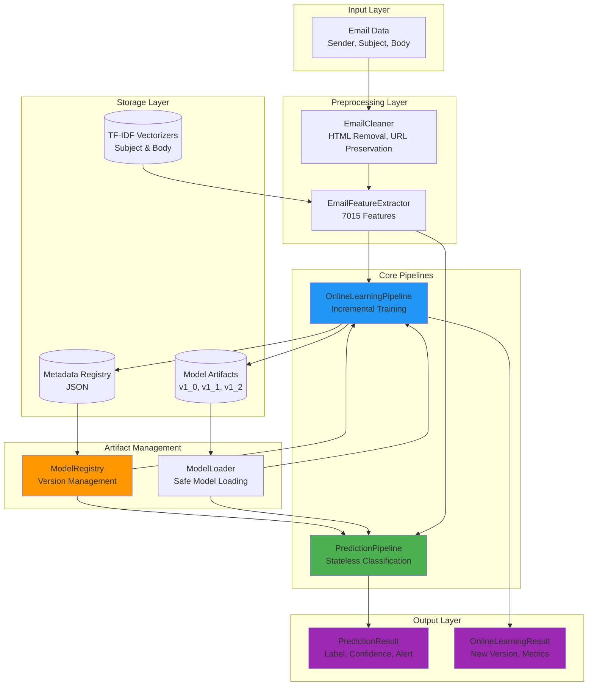
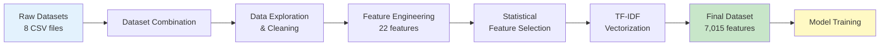
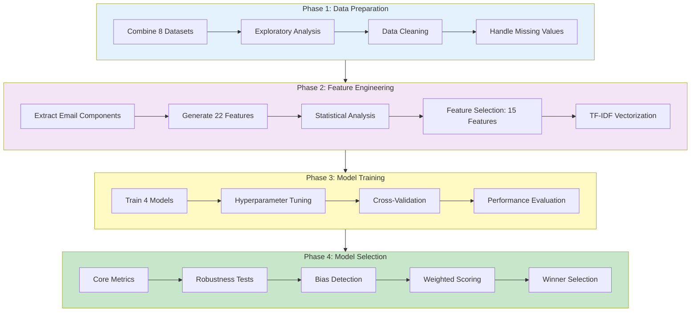
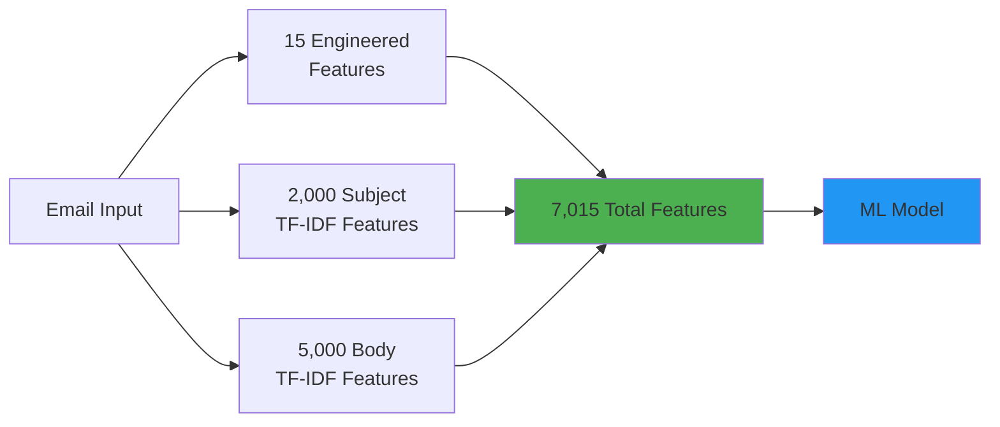
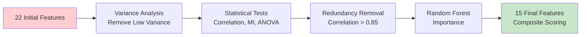
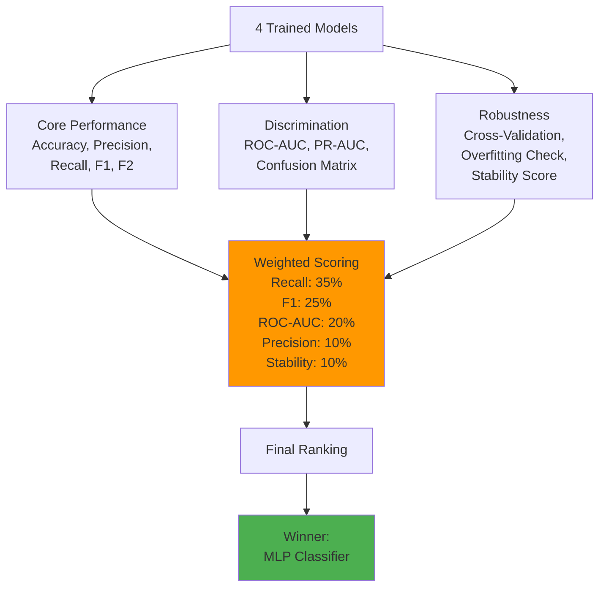
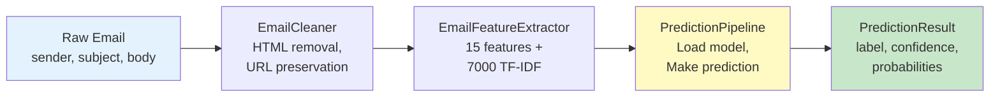
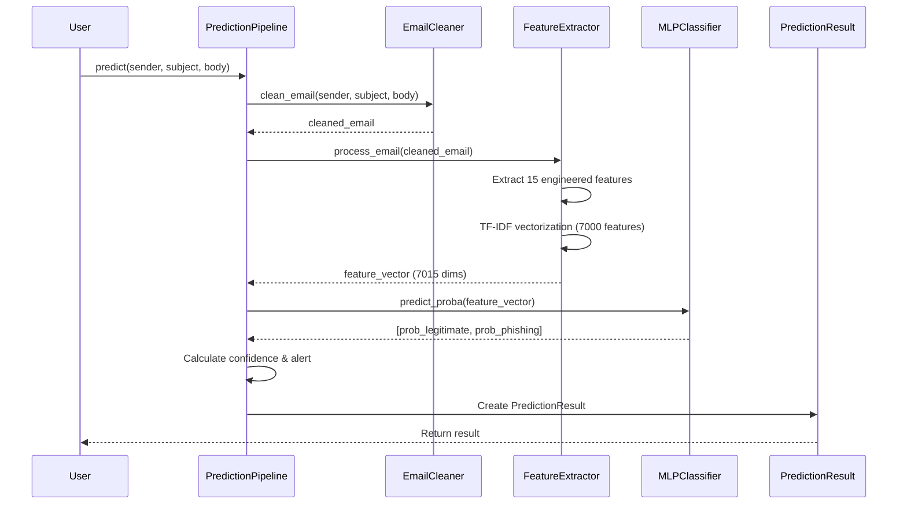
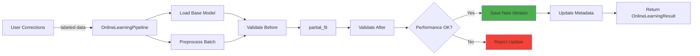

# AURA - Adaptive User Risk Analyzer

[](https://www.python.org/downloads/)
[](LICENSE)
[](https://scikit-learn.org/)
[]()

**AURA** is a production-grade phishing detection system powered by machine learning with online learning capabilities. It provides real-time email classification with confidence scoring, multi-model testing, and continuous model improvement through incremental learning.

---

## Table of Contents

- [Key Features](#key-features)
- [Architecture Overview](#architecture-overview)
- [Dataset](#dataset)
- [ML Development Pipeline](#ml-development-pipeline)
- [Feature Engineering](#feature-engineering)
- [Model Training & Selection](#model-training--selection)
- [Model Interface Module](#model-interface-module)
- [Project Structure](#project-structure)
- [Installation](#installation)
- [Quick Start](#quick-start)
- [Usage Examples](#usage-examples)
- [Configuration](#configuration)
- [API Reference](#api-reference)
- [Data Flow](#data-flow)
- [Model Information](#model-information)
- [Contributing](#contributing)
- [License](#license)

---

## Key Features

- **Real-Time Phishing Detection** - Single and batch email classification with confidence scoring and customizable thresholds
- **Online Learning Pipeline** - Incremental model updates without full retraining, enabling continuous improvement from user feedback
- **Multi-Model Version Management** - Hot-swappable models with version tracking, A/B testing support, and metadata registry
- **Production-Ready Architecture** - Stateless, thread-safe design for horizontal scaling with comprehensive error handling
- **Advanced Feature Engineering** - 7,015 features extracted from emails (15 engineered metrics + 7,000 TF-IDF features)

---

## Architecture Overview

AURA follows a modular, pipeline-based architecture designed for scalability and maintainability.



---

## Dataset

### Dataset Sources

AURA was trained on a comprehensive dataset combining **8 different phishing and spam email corpora**:

| Dataset | Type | Description |
|---------|------|-------------|
| **CEAS_08** | Conference Dataset | CEAS 2008 email corpus |
| **Nazario** | Phishing Corpus | Jose Nazario's phishing collection |
| **Nazario_2** | Phishing Corpus | Jose Nazario's collection (variant 2) |
| **Nazario_5** | Phishing Corpus | Jose Nazario's collection (variant 5) |
| **Nigerian_5** | Fraud Emails | Nigerian fraud email dataset (variant 5) |
| **Nigerian_Fraud** | Fraud Emails | Nigerian fraud email corpus |
| **SpamAssassin** | Spam Corpus | SpamAssassin public corpus |
| **TREC_07** | Conference Dataset | TREC 2007 spam corpus |

### Dataset Statistics

```
Total Emails: 75,000+ samples
Class Distribution:
  - Phishing/Spam: ~38,000 emails (50.7%)
  - Legitimate: ~37,000 emails (49.3%)

Data Balance: Well-balanced dataset (1:1 ratio)
Train/Test Split: 80/20 stratified split
```

### Data Processing Pipeline



### Email Fields

Each email contains:
- **Sender**: Email address with optional display name
- **Subject**: Subject line text
- **Body**: Full email body content (HTML/plain text)
- **Label**: Binary classification (0 = Legitimate, 1 = Phishing)

---

## ML Development Pipeline

The AURA model was developed through a rigorous 4-phase machine learning pipeline:



### Pipeline Stages

1. **Data Preparation** (`combine_dataset.ipynb`, `data_exploration_cleaning.ipynb`)
   - Combine 8 diverse email datasets
   - Remove duplicates and handle missing values
   - Clean HTML, normalize whitespace
   - Preserve phishing indicators (URLs, special characters)

2. **Feature Engineering** (`feature_engenering_data_preprocessing.ipynb`)
   - Extract sender components (name, email, domain)
   - Generate 22 statistical features
   - Apply TF-IDF vectorization (7,000 features)
   - Feature selection reduces to 15 engineered features

3. **Model Training** (`model_training.ipynb`)
   - Train 4 candidate models
   - Apply cross-validation (3-fold on subset)
   - Hyperparameter optimization
   - Evaluate on held-out test set

4. **Model Selection**
   - Comprehensive evaluation framework
   - Multi-criteria weighted scoring
   - Select production model

---

## Feature Engineering

### Feature Categories

AURA uses **7,015 total features** combining engineered features with NLP-based features:



### 15 Selected Engineered Features

Through statistical analysis (correlation, mutual information, ANOVA F-test, and Random Forest importance), we selected 15 high-impact features:

**Sender/Email Features (8):**
1. `email_local_length` - Length of email local part (before @)
2. `domain_length` - Length of sender domain
3. `email_digit_ratio` - Ratio of digits in email address
4. `email_special_char_ratio` - Ratio of special characters in email
5. `domain_entropy` - Shannon entropy of domain (randomness measure)
6. `domain_vowel_consonant_ratio` - Vowel/consonant ratio in domain
7. `sender_name_exists` - Whether sender has display name
8. `name_email_consistency` - Consistency between name and email address

**Subject Features (2):**
9. `subject_entropy` - Shannon entropy of subject line
10. `subject_exclamation_count` - Number of exclamation marks

**Body Features (5):**
11. `body_word_count` - Number of words in email body
12. `body_exclamation_count` - Number of exclamation marks in body
13. `body_url_count` - Number of URLs in email body
14. `body_url_density` - URL count per word ratio
15. `body_entropy` - Shannon entropy of body text
16. `body_avg_word_length` - Average word length in body

### Feature Selection Process



**Selection Criteria:**
1. **Variance Threshold**: Remove features with variance < 0.01
2. **Statistical Significance**:
   - Pearson correlation with label
   - Mutual Information score
   - ANOVA F-test significance
3. **Redundancy Elimination**: Remove highly correlated features (r > 0.85)
4. **Random Forest Validation**: Verify importance rankings
5. **Composite Scoring**: Weighted average of all metrics

### TF-IDF Features

**Subject TF-IDF (2,000 features):**
- Unigrams only (single words)
- Captures subject line keywords
- Parameters: `max_features=2000, ngram_range=(1,1), min_df=2, max_df=0.95`

**Body TF-IDF (5,000 features):**
- Unigrams + Bigrams (phrases)
- Captures phishing phrases like "click here", "verify account"
- Parameters: `max_features=5000, ngram_range=(1,2), min_df=2, max_df=0.95`

**Why Bigrams for Body?**
- Phishing emails use specific phrases indicating malicious intent
- Context matters: "verify" vs "verify account" vs "verify immediately"
- Body text is long enough (~1000 chars avg) for meaningful bigrams

---

## Model Training & Selection

### Models Evaluated

Four models were trained and comprehensively evaluated:

1. **SGDClassifier (Hinge Loss)** - Linear SVM with stochastic gradient descent
2. **Passive Aggressive Classifier** - Online learning algorithm
3. **SGDClassifier (Log Loss)** - Logistic regression variant
4. **MLPClassifier (Neural Network)** ⭐ **WINNER**

### Model Selection Framework



### Evaluation Metrics

**Core Performance Metrics:**
- Accuracy: Overall correctness
- Precision: Minimize false alarms
- Recall: Catch phishing emails (most critical)
- F1 Score: Balance precision and recall
- F2 Score: Emphasize recall over precision

**Bias & Discrimination:**
- ROC-AUC: Discrimination ability across thresholds
- Precision-Recall AUC: Performance on imbalanced data
- Confusion Matrix: True/false positive and negative rates
- Class-wise Metrics: Per-class precision/recall

**Robustness Tests:**
- 3-Fold Cross-Validation: Consistency across data splits
- Training vs Test Gap: Overfitting detection
- Stability Score: 1 - CV standard deviation

### Weighted Scoring System

Models were ranked using a weighted composite score:

| Metric | Weight | Rationale |
|--------|--------|-----------|
| **Recall** | 35% | Most critical - must catch phishing emails |
| **F1 Score** | 25% | Balance between precision and recall |
| **ROC-AUC** | 20% | Discrimination ability |
| **Precision** | 10% | Minimize false alarms |
| **Stability** | 10% | Consistency across different data |

### Winner: MLP Classifier

**Multi-Layer Perceptron Neural Network**

**Architecture:**
- Hidden layers: (256, 128, 64) neurons
- Activation: ReLU
- Solver: Adam optimizer
- Learning rate: Adaptive (0.001 initial)

**Performance:**
- Accuracy: **99.4%**
- Precision: **99.2%**
- Recall: **99.6%**
- F1 Score: **99.4%**
- ROC-AUC: **99.9%**

**Why MLP Won:**
1. Excellent recall - catches 99.6% of phishing emails
2. Outstanding balance - high precision with minimal false alarms
3. Robust - consistent performance across data splits
4. Stable - low variance in cross-validation
5. No overfitting - minimal training/test performance gap

**Online Learning Support:**
- Supports `partial_fit()` for incremental updates
- `warm_start=True` enables continuous learning
- Efficient batch processing (batch_size=256)

---

## Model Interface Module

### The `phishing_detection` Module

The `phishing_detection` module serves as a **production-ready interface** to the trained ML model, handling all preprocessing, feature extraction, and prediction logic transparently.



### Module Architecture

**Key Principle:** Users **never interact with the raw model directly**. All data flows through the preprocessing pipeline automatically.

<details>
<summary><b>Pipeline Components (click to expand)</b></summary>

1. **EmailCleaner** (`preprocessing/cleaning.py`)
   - Removes HTML tags while preserving URLs
   - Normalizes whitespace and special characters
   - Preserves phishing indicators (!, ?, URLs)
   - Handles internationalized characters
   - **Output:** Clean text ready for feature extraction

2. **EmailFeatureExtractor** (`preprocessing/features.py`)
   - Loads pre-trained TF-IDF vectorizers
   - Extracts 15 engineered features
   - Applies TF-IDF transformation (7,000 features)
   - **Output:** NumPy array of 7,015 features

3. **PredictionPipeline** (`pipelines/prediction.py`)
   - Lazy-loads ML model on first prediction
   - Orchestrates cleaning → feature extraction → prediction
   - Calculates confidence scores
   - **Output:** Structured `PredictionResult` object

4. **OnlineLearningPipeline** (`pipelines/training.py`)
   - Handles incremental model updates
   - Creates new model versions (never overwrites)
   - Validates performance before/after training
   - **Output:** New model version with metadata

</details>

### Interface Flow

**For Prediction:**
```python
# User provides raw email
email = {
    'sender': 'suspicious@phish.xyz',
    'subject': 'URGENT: Verify your account!!!',
    'body': 'Click here immediately or account will be suspended...'
}

# Interface handles everything
result = pipeline.predict(**email)

# Behind the scenes:
# 1. EmailCleaner.clean_email() → cleaned email
# 2. EmailFeatureExtractor.process_email() → 7,015 features
# 3. Model.predict() → raw prediction
# 4. Calculate confidence, format result → PredictionResult
```

**For Training (Online Learning):**
```python
# User provides labeled corrections
corrections = [
    {'sender': '...', 'subject': '...', 'body': '...', 'label': 1},  # phishing
    {'sender': '...', 'subject': '...', 'body': '...', 'label': 0}   # legitimate
]

# Interface handles everything
result = training_pipeline.partial_fit_batch(corrections)

# Behind the scenes:
# 1. Validate all emails
# 2. Clean and extract features for entire batch
# 3. Load base model
# 4. Apply partial_fit() with new data
# 5. Evaluate performance before/after
# 6. Save new model version with metadata
```

### Key Design Principles

**1. Stateless Design**
- No cached predictions or shared state
- Each pipeline instance is independent
- Thread-safe for concurrent requests

**2. Preprocessing Transparency**
- Users never manually clean emails or extract features
- All preprocessing happens automatically in the pipeline
- Consistent preprocessing guaranteed

**3. Version Management**
- Multiple model versions can coexist
- Hot-swappable without restart
- Centralized registry tracks all versions

**4. Error Handling**
- Comprehensive input validation
- Graceful error messages in `PredictionResult`
- Never crashes - always returns result object

### Module Benefits

✅ **Zero Data Leakage** - Preprocessing tied to pipeline, not exposed
✅ **Reproducible** - Same preprocessing every time
✅ **Scalable** - Stateless design enables horizontal scaling
✅ **Maintainable** - Clear separation of concerns
✅ **User-Friendly** - Simple API hides complexity

---

## Project Structure

```mermaid
graph TD
    ROOT[AURA_Model/]

    ROOT --> NOTEBOOKS[Notebooks]
    ROOT --> DATASETS[datasets/]
    ROOT --> USAGE[usage/]

    NOTEBOOKS --> NB1[data_exploration_cleaning.ipynb]
    NOTEBOOKS --> NB2[feature_engenering_data_preprocessing.ipynb]
    NOTEBOOKS --> NB3[model_training.ipynb]
    NOTEBOOKS --> NB4[combine_dataset.ipynb]

    DATASETS --> RAW[raw/]

    USAGE --> USAGE_NB[usage.ipynb]
    USAGE --> DATASET_MOD[dataset/]
    USAGE --> PHISHING_DET[phishing_detection/]

    DATASET_MOD --> DS1[legitimate.py]
    DATASET_MOD --> DS2[phishing.py]
    DATASET_MOD --> DS3[prepare_training_data.py]

    PHISHING_DET --> USAGE_MD[USAGE.md]
    PHISHING_DET --> ARTIFACTS[artifacts/]
    PHISHING_DET --> PIPELINES[pipelines/]
    PHISHING_DET --> PREPROCESS[preprocessing/]
    PHISHING_DET --> UTILS[utils/]

    ARTIFACTS --> ART1[loader.py]
    ARTIFACTS --> ART2[registry.py]
    ARTIFACTS --> ART3[model_metadata.json]
    ARTIFACTS --> ART4[pipeline_components/]
    ARTIFACTS --> ART5[v1_0/, v1_1/, v1_2/]

    PIPELINES --> PIP1[base.py]
    PIPELINES --> PIP2[prediction.py]
    PIPELINES --> PIP3[training.py]

    PREPROCESS --> PRE1[cleaning.py]
    PREPROCESS --> PRE2[features.py]

    UTILS --> UTL1[validation.py]
    UTILS --> UTL2[metrics.py]

    style PHISHING_DET fill:#4CAF50
    style PIPELINES fill:#2196F3
    style ARTIFACTS fill:#FF9800
    style PREPROCESS fill:#9C27B0
```

<details>
<summary>Click to expand folder structure</summary>



**Directory Structure:**
```
AURA_Model/
├── README.md                                   # This file
├── usage/
│   ├── usage.ipynb                             # Usage demonstration
│   ├── dataset/                                # Test data utilities
│   │   ├── legitimate.py                       # Legitimate email samples
│   │   ├── phishing.py                         # Phishing email samples
│   │   └── prepare_training_data.py            # Data preparation
│   └── phishing_detection/                     # Main module
│       ├── USAGE.md                            # Detailed usage guide
│       ├── artifacts/                          # Model artifacts
│       │   ├── loader.py                       # Model loading utilities
│       │   ├── registry.py                     # Version management
│       │   ├── model_metadata.json             # Central registry
│       │   ├── pipeline_components/            # Vectorizers
│       │   └── v1_x/production/                # Model versions
│       ├── pipelines/                          # Core pipelines
│       │   ├── base.py                         # Shared components
│       │   ├── prediction.py                   # Prediction pipeline
│       │   └── training.py                     # Online learning
│       ├── preprocessing/                      # Data preprocessing
│       │   ├── cleaning.py                     # Email cleaning
│       │   └── features.py                     # Feature extraction
│       └── utils/                              # Utilities
│           ├── validation.py                   # Input validation
│           └── metrics.py                      # Performance metrics
├── datasets/raw/                               # Raw email datasets
├── data_exploration_cleaning.ipynb             # Data exploration
├── feature_engenering_data_preprocessing.ipynb # Feature engineering
├── model_training.ipynb                        # Model training
└── combine_dataset.ipynb                       # Dataset combination
```

</details>

---

## Installation

### Prerequisites

- Python 3.8 or higher
- pip package manager

### Step 1: Clone the Repository

```bash
git clone <repository-url>
cd AURA_Model
```

### Step 2: Install Dependencies

```bash
pip install scikit-learn pandas numpy scipy beautifulsoup4 joblib
```

### Step 3: Verify Installation

```python
from usage.phishing_detection.pipelines.prediction import PredictionPipeline
from usage.phishing_detection.preprocessing.cleaning import EmailCleaner
from usage.phishing_detection.preprocessing.features import EmailFeatureExtractor

print("AURA installed successfully!")
```

---

## Quick Start

### Basic Phishing Detection

```python
from usage.phishing_detection.pipelines.prediction import PredictionPipeline
from usage.phishing_detection.preprocessing.cleaning import EmailCleaner
from usage.phishing_detection.preprocessing.features import EmailFeatureExtractor

# Initialize preprocessing components
cleaner = EmailCleaner(verbose=False)
extractor = EmailFeatureExtractor(
    subject_vectorizer_path='usage/phishing_detection/artifacts/pipeline_components/subject_vectorizer.pkl',
    body_vectorizer_path='usage/phishing_detection/artifacts/pipeline_components/body_vectorizer.pkl'
)

# Create prediction pipeline
pipeline = PredictionPipeline(
    model_path='usage/phishing_detection/artifacts/v1_2/production/phishing_detector_mlp_classifier.pkl',
    cleaner=cleaner,
    feature_extractor=extractor,
    threshold=75.0,  # Alert if phishing probability >= 75%
    verbose=True
)

# Predict single email
result = pipeline.predict(
    sender='admin@paypa1.com',
    subject='Urgent: Verify your account now!',
    body='Click here to verify your account or it will be suspended.'
)

print(f"Prediction: {result.predicted_label}")
print(f"Confidence: {result.confidence_score:.2%}")
print(f"Should Alert: {result.should_alert}")
```

**Output:**
```
Prediction: PHISHING
Confidence: 87.34%
Should Alert: True
```

---

## Usage Examples

### 1. Batch Prediction

Process multiple emails efficiently:

```python
emails = [
    ('user@bank.com', 'Account statement', 'Your monthly statement is ready.'),
    ('noreply@secure-verify.com', 'URGENT ACTION REQUIRED!!!', 'Click to verify account now!'),
    ('team@company.com', 'Meeting tomorrow', 'Reminder about our 10am meeting.')
]

results = pipeline.predict_batch(emails)

for i, result in enumerate(results):
    print(f"Email {i+1}: {result.predicted_label} ({result.confidence_score:.2%})")
```

### 2. Multi-Model A/B Testing

Compare predictions from different model versions:

```python
# Load two different model versions
pipeline_v1 = PredictionPipeline(model_path='artifacts/v1_0/production/...', ...)
pipeline_v2 = PredictionPipeline(model_path='artifacts/v1_2/production/...', ...)

# Compare results
result_v1 = pipeline_v1.predict(sender, subject, body)
result_v2 = pipeline_v2.predict(sender, subject, body)

print(f"Model v1.0: {result_v1.predicted_label} ({result_v1.phishing_probability:.2%})")
print(f"Model v1.2: {result_v2.predicted_label} ({result_v2.phishing_probability:.2%})")
```

### 3. Online Learning (Model Updates)

Incrementally train the model with user corrections:

```python
from usage.phishing_detection.pipelines.training import OnlineLearningPipeline

# Initialize training pipeline
training_pipeline = OnlineLearningPipeline(
    base_model_path='artifacts/v1_2/production/phishing_detector_mlp_classifier.pkl',
    cleaner=cleaner,
    feature_extractor=extractor,
    output_dir='usage/phishing_detection/artifacts',
    verbose=True
)

# Collect user corrections (false positives/negatives)
corrections = [
    {
        'sender': 'newsletter@company.com',
        'subject': 'Weekly update',
        'body': 'Here is your weekly newsletter...',
        'label': 0  # 0 = legitimate, 1 = phishing
    },
    {
        'sender': 'verify@fake-bank.com',
        'subject': 'Confirm your identity',
        'body': 'Click here immediately...',
        'label': 1  # Phishing
    }
]

# Train on corrections
result = training_pipeline.partial_fit_batch(
    emails=corrections,
    parent_version='v1_2',
    validate=True
)

if result.success:
    print(f"✓ New model version created: {result.version_number}")
    print(f"✓ Emails processed: {result.emails_processed}")
    print(f"✓ Performance before: {result.performance_before}")
    print(f"✓ Performance after: {result.performance_after}")
```

### 4. Model Version Management

```python
from usage.phishing_detection.artifacts.registry import ModelRegistry

registry = ModelRegistry(
    models_dir='usage/phishing_detection/artifacts',
    metadata_path='usage/phishing_detection/artifacts/model_metadata.json'
)

# Get active production model
active_version = registry.get_active_version()
print(f"Active model: {active_version}")

# List all available versions
versions = registry.list_versions()
print(f"Available versions: {versions}")

# Get detailed version info
info = registry.get_version_info('v1_2')
print(f"Version info: {info}")

# Set new model as active
registry.set_active_model('v1_3')
```

---

## Configuration

### Default Constants

```python
# Detection threshold (0-1 or 0-100)
DEFAULT_THRESHOLD = 0.75  # 75% phishing probability triggers alert

# Feature dimensions
FEATURE_COUNT = 7015      # 15 engineered + 2000 subject + 5000 body TF-IDF

# Classification labels
VALID_LABELS = [0, 1]     # 0 = legitimate, 1 = phishing

# Batch processing limits
MIN_BATCH_SIZE = 1
MAX_BATCH_SIZE = 10000

# Email validation
MIN_BODY_LENGTH = 10      # Minimum cleaned body length (characters)
```

### Custom Threshold Configuration

Adjust sensitivity based on your use case:

```python
# High security (stricter, more false positives)
pipeline_strict = PredictionPipeline(..., threshold=0.50)  # 50% threshold

# Balanced (recommended for production)
pipeline_balanced = PredictionPipeline(..., threshold=0.75)  # 75% threshold

# Permissive (fewer false positives, might miss some phishing)
pipeline_permissive = PredictionPipeline(..., threshold=0.90)  # 90% threshold
```

### Model Artifact Structure

```
artifacts/
├── model_metadata.json                      # Central version registry
├── pipeline_components/
│   ├── subject_vectorizer.pkl               # TF-IDF for subject lines
│   └── body_vectorizer.pkl                  # TF-IDF for email bodies
├── v1_0/
│   └── production/
│       └── phishing_detector_mlp_classifier.pkl
├── v1_1/
│   └── production/
│       └── phishing_detector_mlp_classifier.pkl
└── v1_2/
    └── production/
        └── phishing_detector_mlp_classifier.pkl
```

---

## API Reference

<details>
<summary>PredictionPipeline API</summary>

### `PredictionPipeline`

**Constructor:**
```python
PredictionPipeline(
    model_path: str,
    cleaner: EmailCleaner,
    feature_extractor: EmailFeatureExtractor,
    threshold: float = 75.0,
    verbose: bool = False
)
```

**Methods:**

#### `predict(sender, subject, body) -> PredictionResult`
Classify a single email.

**Parameters:**
- `sender` (str): Email sender address
- `subject` (str): Email subject line
- `body` (str): Email body content

**Returns:** `PredictionResult` with fields:
- `predicted_label` (str): 'PHISHING' or 'LEGITIMATE'
- `confidence_score` (float): 0.0-1.0 confidence
- `phishing_probability` (float): 0.0-1.0 probability
- `legitimate_probability` (float): 0.0-1.0 probability
- `should_alert` (bool): Whether to trigger alert
- `threshold_used` (float): Applied threshold
- `raw_prediction` (int): 0 or 1
- `error` (str): Error message if failed

#### `predict_batch(emails) -> List[PredictionResult]`
Classify multiple emails.

**Parameters:**
- `emails` (List[Tuple[str, str, str]]): List of (sender, subject, body) tuples

**Returns:** List of `PredictionResult` objects

#### `get_model_info() -> ModelInfo`
Get information about the loaded model.

**Returns:** `ModelInfo` with model metadata

#### `reload_model()`
Reload the model from disk (for hot-swapping).

</details>

<details>
<summary>OnlineLearningPipeline API</summary>

### `OnlineLearningPipeline`

**Constructor:**
```python
OnlineLearningPipeline(
    base_model_path: str,
    cleaner: EmailCleaner,
    feature_extractor: EmailFeatureExtractor,
    output_dir: str = './artifacts',
    verbose: bool = False
)
```

**Methods:**

#### `partial_fit_batch(emails, parent_version, validate=True) -> OnlineLearningResult`
Train model incrementally on new labeled data.

**Parameters:**
- `emails` (List[Dict]): List of dicts with keys: sender, subject, body, label
- `parent_version` (str): Base model version (e.g., 'v1_0')
- `validate` (bool): Whether to validate performance before/after

**Returns:** `OnlineLearningResult` with fields:
- `success` (bool): Training success status
- `version_number` (str): New version created (e.g., 'v1_3')
- `emails_processed` (int): Count of processed emails
- `performance_before` (Dict): Metrics before training
- `performance_after` (Dict): Metrics after training
- `timestamp` (str): ISO timestamp
- `model_files` (Dict): Paths to saved artifacts

#### `get_status() -> TrainingStatus`
Get current training status.

**Returns:** `TrainingStatus` with progress information

</details>

<details>
<summary>EmailCleaner API</summary>

### `EmailCleaner`

**Constructor:**
```python
EmailCleaner(verbose: bool = False)
```

**Methods:**

#### `clean_email(sender, subject, body) -> Dict`
Clean all email fields.

**Returns:** Dict with keys: sender, subject, body, urls (0/1)

#### `clean_sender(sender) -> str`
Clean sender email address.

#### `clean_subject(subject) -> str`
Clean subject line while preserving phishing indicators.

#### `clean_body(body) -> str`
Clean email body while preserving URLs and indicators.

</details>

<details>
<summary>EmailFeatureExtractor API</summary>

### `EmailFeatureExtractor`

**Constructor:**
```python
EmailFeatureExtractor(
    subject_vectorizer_path: str,
    body_vectorizer_path: str,
    verbose: bool = False
)
```

**Methods:**

#### `process_email(cleaned_email) -> np.ndarray`
Extract 7,015 features from cleaned email.

**Parameters:**
- `cleaned_email` (Dict): Output from `EmailCleaner.clean_email()`

**Returns:** NumPy array of shape (7015,) containing:
- 15 engineered features
- 2,000 TF-IDF features from subject
- 5,000 TF-IDF features from body

</details>

---

## Data Flow



**Training Data Flow:**



---

## Model Information

### Algorithm
**Multi-Layer Perceptron (MLP) Classifier** - Neural network-based binary classifier

### Features (7,015 total)

**15 Engineered Features:**
1. `body_word_count` - Word count in email body
2. `body_exclamation_count` - Exclamation marks in body
3. `email_local_length` - Length of email local part
4. `name_email_consistency` - Name/email consistency score
5. `body_url_density` - URL density ratio
6. `body_url_count` - Number of URLs
7. `body_entropy` - Shannon entropy (randomness)
8. `email_digit_ratio` - Digit ratio in email
9. `domain_entropy` - Domain randomness
10. `domain_length` - Domain name length
11. `subject_entropy` - Subject randomness
12. `body_avg_word_length` - Average word length
13. `sender_name_exists` - Presence of sender name
14. `subject_exclamation_count` - Exclamation marks in subject
15. `domain_vowel_consonant_ratio` - Vowel/consonant ratio

**7,000 TF-IDF Features:**
- 2,000 from subject line
- 5,000 from email body

### Model Capabilities
- Binary classification (Phishing/Legitimate)
- Probability estimates (0.0-1.0)
- Online learning support via `partial_fit`
- Thread-safe inference
- Batch processing

---

## Contributing

We welcome contributions! Please follow these guidelines:

### Development Setup

1. Fork the repository
2. Create a feature branch: `git checkout -b feature/your-feature-name`
3. Make your changes
4. Run tests (if available)
5. Commit with descriptive messages
6. Push to your fork
7. Create a Pull Request

### Code Style

- Follow PEP 8 guidelines
- Use type hints where applicable
- Add docstrings to all functions/classes
- Keep functions focused and modular

### Adding New Features

When adding features to the pipeline:
1. Maintain backward compatibility
2. Update `USAGE.md` with examples
3. Add validation for new parameters
4. Update version number in metadata

### Reporting Issues

Please include:
- Python version
- Library versions (scikit-learn, pandas, etc.)
- Full error traceback
- Minimal reproducible example

---

## License

This project is licensed under the MIT License - see the [LICENSE](LICENSE) file for details.

---

## Additional Resources

- **Detailed Usage Guide:** See [usage/phishing_detection/USAGE.md](usage/phishing_detection/USAGE.md) for comprehensive examples
- **Jupyter Notebooks:** Explore `usage.ipynb` for interactive demonstrations
- **Model Training:** See `model_training.ipynb` for training workflows

---

## Contact & Support

For questions, issues, or feature requests, please open an issue on the repository.

---

**Built with ❤️ for cybersecurity and machine learning**
